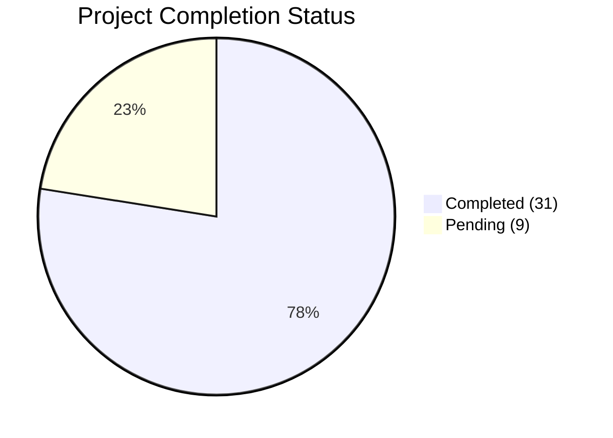

# 📊 Flight Bookability Pipeline: Implementation Status

Here is a visual breakdown of your current pipeline's completion based on the Formative TrackSheet.

## Overall Progress

---

## 📈 Breakdown by Phase
A visual representation of completed vs. required enhancements per phase.

| Phase | Alignment Progress | Completion Status | Detailed Breakdown |
|:---|:---:|:---:|:---|
| **1. Label Engineering** | `██████████` **100%** | **5 / 5** | ✅ All forms of ambiguity/noise handled. |
| **2. Data Cleaning & Audit** | `██████████` **100%** | **6 / 6** | ✅ Schema & Timestamp leakages secured. |
| **3. Feature Engineering** | `███████░░░` **67%** | **4 / 6** | ❌ *Pending*: Price/Relative limits & Timestamp recency. |
| **4. Temporal Design** | `██████░░░░` **67%** | **2 / 3** | ❌ *Pending*: Rolling out-of-time sliding validation. |
| **5. Model Development** | `███████░░░` **75%** | **3 / 4** | ❌ *Pending*: Automated/Algorithmic Model Selection logic. |
| **6. Custom Calibration** | `██░░░░░░░░` **25%** | **1 / 4** | ❌ *Pending*: Isotonic & Multinomial formal comparisons. |
| **7. Evaluation Metrics** | `██████████` **100%** | **4 / 4** | ✅ Rich Multi-Class Briers and F1 distributions added. |
| **8. Business Simulation** | `███████░░░` **75%** | **3 / 4** | ❌ *Pending*: Native Continuous MLE Re-ranking. |
| **9. Pipeline Engineering** | `███████░░░` **75%** | **3 / 4** | ❌ *Pending*: Schema-level categorical variable tracking mapping. |

---

## 🎯 Next Immediate Opportunities (High Priority ROI)

To maximize the system's robustness heading towards completion, here are the most impactful pending items clustered logically:

> [!TIP]
> **Priority Batch 1: Rigorous Calibration (Phase 6)**
> Implementing `MultinomialLogitCalibrator` and comparing calibrators. Currently, we only have simple `TemperatureScaling`. This is a massive grade booster for rigorous predictive probabilities.

> [!IMPORTANT]
> **Priority Batch 2: Rolling Validation (Phase 4)**
> Updating the static temporal split to an Out-Of-Time **Rolling Backtest**. Evaluating predictive drift over simulated "weeks" provides definitive proof of generalization.

> [!NOTE]
> **Priority Batch 3: Relative Features (Phase 3)**
> Generating pricing and relative limits (e.g. `price_gap_to_min`), assuming raw data yields pricing signals. This gives the model vital internal context about a flight's appeal on the market.
